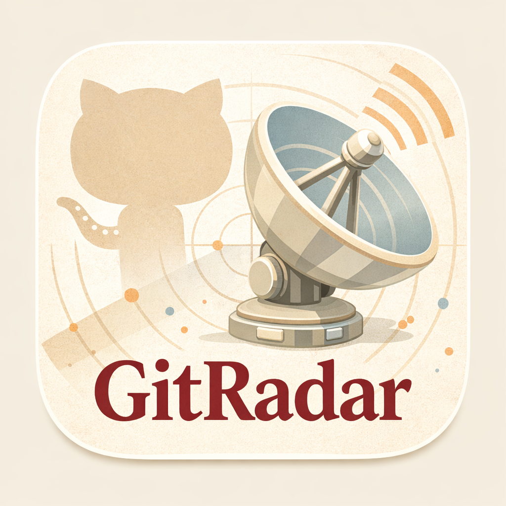

# GitRadar




GitRadar 是一个面向个人与小团队的 GitHub 开源项目雷达。它每天从 GitHub 获取候选仓库，经过规则筛选、主题配额、候选池收敛和 LLM 编辑整理，产出一份中文日报，并支持企业微信群机器人发送、本地归档和网页控制台管理。

现在的 GitRadar 是一个完整产品，而不是单一脚本。你可以直接跑 CLI，也可以打开本地网页，在同一个界面里管理规则、环境配置、执行流程和历史归档。

## 当前版本定位

GitRadar 当前围绕两条主线工作：

- 发现与编辑：从 GitHub 候选仓库里挑出当天值得看的项目，并给出中文说明
- 本地运营台：把规则、LLM、企业微信、调度、执行日志和归档全部收口到本地控制台

这张 `image.png` 现在作为 GitRadar 的主图与象征图使用，代表产品对外的统一视觉入口。

## 核心能力

- 多来源候选抓取：Trending、最近更新、最近创建
- 规则化筛选：主题关键词、黑名单、时间阈值、成熟度和分桶规则
- LLM 编辑整理：从候选池里生成中文日报条目
- 企业微信发送：支持通过群机器人 webhook 推送日报
- 本地归档：保存每日结果、反馈记录与分析结果
- 网页控制台：用中文界面管理配置、执行任务和浏览归档
- Docker 运行：适合本地长期挂起
- Windows 双击启动：适合非命令行使用场景

## 网页控制台

网页控制台是当前版本最直接的使用方式。它把原来分散在 `.env`、配置文件和命令行里的操作集中到了一个本地界面。

当前主要包含这些页面：

- 仪表盘：查看配置状态、最近归档和最近命令结果
- 规则配置：维护主题、黑名单、权重、阈值和配额
- 环境配置：独立管理 LLM、WeCom、调度三块设置
- 执行中心：触发校验、生成、发送样例和归档分析
- 归档浏览：查看日报内容并记录“收藏 / 稍后看 / 跳过”反馈

### 环境配置页

环境配置页是当前版本的关键变化。它把容易混在一起的运行参数拆成了 3 个独立区域：

- LLM 配置：`GR_API_KEY`、`GR_BASE_URL`、`GR_MODEL`
- 企业微信配置：`GITRADAR_WECOM_WEBHOOK_URL`
- 调度配置：每日发送时间与时区，持久化到 `config/schedule.json`

这意味着你不需要再手动翻 `.env` 和脚本去找入口，常用运行配置已经可以直接在网页里维护。

## 快速开始

### 1. 准备环境

要求：

- Node.js 20+
- npm 10+
- 可用的 GitHub Token
- 可用的 LLM 网关配置
- 如果要发群消息，需要企业微信群机器人 webhook

初始化：

```bash
cp .env.example .env
npm install
```

### 2. 启动本地控制台

```bash
npm run build:web
npm run start:console
```

默认监听：

- 控制台与本地 API：`http://127.0.0.1:3210`

开发模式：

```bash
npm run dev:web-api
npm run dev:web
```

开发时默认端口：

- API：`http://127.0.0.1:3210`
- 前端开发服务：`http://127.0.0.1:4173`

## Windows 双击启动

如果你更希望以“本地应用”的方式使用 GitRadar，当前推荐直接用仓库自带脚本。

前提：

- 已安装并启动 Docker Desktop
- 已准备好 `.env`
- 仓库已经 clone 到本机

首次准备：

```bash
cp .env.example .env
```

Windows 上可直接双击：

- `start-gitradar.bat`
- `stop-gitradar.bat`

`start-gitradar.bat` 会自动完成：

1. 检查 Docker Desktop
2. 检查 `docker compose`
3. 检查 `.env`
4. 构建或启动容器
5. 等待控制台健康检查通过
6. 打开 `http://127.0.0.1:3210`

## Docker 运行

如果你希望 GitRadar 长期驻留在本机，Docker 是最稳的运行方式。

启动：

```bash
docker compose up --build
```

停止：

```bash
docker compose down
```

默认行为：

- 控制台端口：`127.0.0.1:3210`
- 时区：`Asia/Shanghai`
- 容器内日报任务时间：`08:17`
- 定时执行命令：`npm run generate:digest:send`

宿主机保留数据：

- `config/`
- `data/`
- `.env`

## 常用 CLI

GitRadar 依然保留完整 CLI，适合调试、自动化和手工复盘。

```bash
npm run validate:digest-rules
npm run generate:digest
npm run generate:digest -- --send
npm run analyze:digest -- --date 2026-03-26
npm run feedback:list
npm run migrate:archives
npm run send:wecom:sample
```

常见用途：

- `validate:digest-rules`：校验 `config/digest-rules.json`
- `generate:digest`：抓取、筛选、编辑并写入日报归档
- `generate:digest -- --send`：生成日报后发送企业微信
- `analyze:digest`：分析某天归档结果
- `feedback:list`：查看用户反馈记录
- `migrate:archives`：把旧归档迁移到当前 schema
- `send:wecom:sample`：验证企业微信群机器人链路

## 配置结构

当前版本的配置入口主要分成 4 类：

- 规则配置：`config/digest-rules.json`
- 调度配置：`config/schedule.json`
- 环境变量：`.env`
- 运行数据：`data/`

### 必填环境变量

- `GITHUB_TOKEN`
- `GR_API_KEY`
- `GR_BASE_URL`
- `GR_MODEL`
- `GITRADAR_WECOM_WEBHOOK_URL`

### 可选覆盖项

- `GR_GH_API_URL`
- `GR_GH_TRENDING_URL`

## 归档与反馈

GitRadar 不只是发一条消息就结束。它会把日报和后续反馈都保存到本地，便于复盘。

你可以在归档浏览里：

- 阅读历史日报
- 快速翻页查看不同日期
- 标记“收藏 / 稍后看 / 跳过”

也可以通过命令行回看反馈：

```bash
npm run feedback:list
npm run feedback:list -- --action saved
npm run feedback:list -- --action later --format json
```

## 质量保证

仓库内置了基础质量检查与 CI 流程，覆盖：

- Prettier 格式检查
- Markdown lint
- TypeScript typecheck
- 单元测试
- GitHub Actions CI

本地常用检查：

```bash
npm run format:check
npm run lint:md
npm run typecheck
npm test
```

## 适用场景

GitRadar 适合这些用法：

- 每天快速发现值得跟进的新项目
- 为团队做固定节奏的技术雷达播报
- 把 GitHub 信息流整理成中文日报
- 对某几个主题长期观察，例如 AI Agents、Infra、Runtime、DevTools

它不追求“抓得最多”，而是强调“今天为什么值得看”。

## 许可证

MIT
