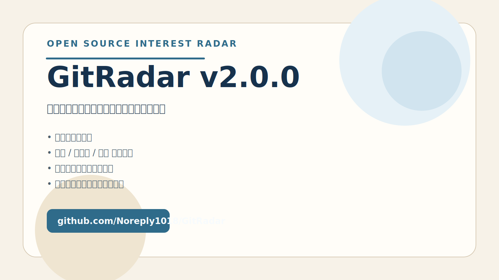

# GitRadar


> 一个把“今天值得看什么”收敛成中文日报，并持续沉淀个人兴趣轨迹的 GitHub 开源项目雷达。

GitRadar 是一个面向个人与小团队的开源项目发现雷达。它每天从 GitHub 获取候选仓库，用规则筛选、证据整理和 LLM 编辑把“今天真正值得看什么”收敛成一份中文日报；同时把配置、归档、反馈、偏好学习和环境验证统一收口到本地中文控制台里。

GitRadar 2.0 的重点已经不再是“把日报发出去”，而是把它做成一个可以持续使用、持续判断、持续复盘的个人开源兴趣雷达。

## 一眼看懂

- 定位：中文开源项目雷达，不是热榜搬运器
- 产出：每天一份“为什么值得看、为什么是现在”的中文日报
- 形态：CLI + Docker + 本地中文控制台
- 核心差异：反馈闭环、偏好学习提示、环境可用性指纹、可回看的个人兴趣轨迹

## 快速入口

- Release：<https://github.com/Noreply1018/GitRadar/releases>
- Showcase：[`docs/showcase.md`](./docs/showcase.md)
- 架构与路线：[`docs/architecture-roadmap.md`](./docs/architecture-roadmap.md)
- 更新记录：[`CHANGELOG.md`](./CHANGELOG.md)

## 现在长什么样



| 首页与环境总览 | 环境配置与可用性指纹 |
| --- | --- |
|  |  |

| 收藏、待看与兴趣轨迹 | 归档日报阅读 |
| --- | --- |
|  |  |

## GitRadar 2.0 核心能力

- 证据化发现：不是简单抄热榜，而是从 Trending、最近更新、最近创建三类候选里收敛当天真正值得看的项目
- 中文编辑日报：每条项目都带“做什么、为什么值得看、为什么是现在、证据、新意、热度”
- 本地中文控制台：把环境配置、主题偏好、收藏反馈、归档阅读和验证入口放到一个界面
- 轻反馈闭环：支持对归档项目标记 `收藏 / 稍后看 / 跳过`
- 轻个性化：根据已有反馈生成兴趣轨迹与偏好学习提示，但不做失控的黑盒推荐
- 编辑型归档：归档顶部会解释“今天为什么是这几条”，而不是只给项目列表
- 环境确定感：GitHub / LLM / 企业微信会显示最近一次成功验证的可用性指纹
- 长期可复盘：本地保留归档、反馈、失败报告和分析结果
- 多运行方式：CLI、Docker、本地控制台、Windows 双击启动都可用

## 它解决的问题

GitHub 上每天都有很多项目在涨星，但真正的问题不是“什么热”，而是：

- 今天到底哪些项目值得点进去看
- 为什么是这些项目
- 为什么是今天
- 我最近到底对哪些方向持续有兴趣
- 我的 GitRadar 配置现在到底是不是活的

GitRadar 把这些问题拆成一条稳定链路：

1. 抓 GitHub 候选
2. 用规则做筛选和主题控制
3. 用模型在受限候选池内完成中文编辑
4. 把结果保存成可重看的归档
5. 记录后续反馈，形成轻量个性化

## 为什么仓库首页先值得看

- README 展示的是当前真实产品，不是概念稿
- 所有控制台截图都来自运行中的本地实例
- 你可以从首页直接判断它是不是你要的工具，而不用先翻代码

## 控制台现在包含什么

### 环境配置

- GitHub 源配置与连通性测试
- LLM Base URL / Model / API Key 配置与测试
- 企业微信 Webhook 配置与测试发送
- 调度时间与时区设置
- 最近一次成功验证的账号、模型、发送时间等可用性指纹

### 主题偏好

- 维护关心主题
- 维护自定义主题词
- 把“感兴趣的方向”显式写入后续筛选逻辑

### 收藏与待看

- 查看当前仍有效的收藏与待看项目
- 从反馈里提炼最近真正感兴趣的主题
- 观察最近连续跳过的主题

### 归档日报

- 逐日查看归档
- 单条阅读每个项目
- 记录 `收藏 / 稍后看 / 跳过`
- 阅读总编前言与偏好学习提示
- 识别“探索位”项目，偶尔跳出舒适区

## 快速开始

### 1. 准备环境

要求：

- Node.js 20+
- npm 10+
- 可用的 GitHub Token
- 可用的 LLM 网关配置
- 如果要发群消息，需要企业微信群机器人 Webhook

初始化：

```bash
cp .env.example .env
npm install
```

### 2. 启动本地控制台

```bash
npm run build:web
npm run start:console
```

默认监听：

- 控制台与本地 API：`http://127.0.0.1:3210`

开发模式：

```bash
npm run dev:web-api
npm run dev:web
```

开发时默认端口：

- API：`http://127.0.0.1:3210`
- 前端开发服务：`http://127.0.0.1:4173`

### 3. 运行截图脚本

如果你要更新 README 和展示页里的控制台截图：

```bash
npm run capture:screenshots
```

默认会从运行中的本地控制台抓取截图，输出到：

- `docs/assets/console/`

## Docker 运行

如果你希望 GitRadar 长期驻留在本机，Docker 是最稳的运行方式。

启动：

```bash
docker compose up --build
```

停止：

```bash
docker compose down
```

默认行为：

- 控制台端口：`127.0.0.1:3210`
- 时区：`Asia/Shanghai`
- 容器内日报任务时间：`08:17`
- 定时执行命令：`npm run generate:digest:send`

宿主机保留数据：

- `config/`
- `data/`
- `.env`

## Windows 双击启动

如果你更希望以“本地应用”的方式使用 GitRadar，仓库自带了 Windows 启动脚本。

前提：

- 已安装并启动 Docker Desktop
- 已准备好 `.env`
- 仓库已 clone 到本机

首次准备：

```bash
cp .env.example .env
```

Windows 上可直接双击：

- `start-gitradar.bat`
- `stop-gitradar.bat`

`start-gitradar.bat` 会自动完成：

1. 检查 Docker Desktop
2. 检查 `docker compose`
3. 检查 `.env`
4. 构建或启动容器
5. 等待控制台健康检查通过
6. 打开 `http://127.0.0.1:3210`

## CLI 仍然完整可用

GitRadar 2.0 不是“只有前端”。当前 CLI 依然是调试、分析和自动化的重要入口。

```bash
npm run validate:digest-rules
npm run generate:digest
npm run generate:digest -- --send
npm run analyze:digest -- --date 2026-03-30
npm run feedback:list
npm run migrate:archives
npm run send:wecom:sample
```

常见用途：

- `validate:digest-rules`：校验 `config/digest-rules.json`
- `generate:digest`：抓取、筛选、编辑并写入日报归档
- `generate:digest -- --send`：生成日报后发送企业微信
- `analyze:digest`：分析某天归档结果
- `feedback:list`：查看收藏、稍后看和跳过反馈
- `migrate:archives`：把旧归档迁移到当前 schema
- `send:wecom:sample`：验证企业微信群机器人链路

## 配置结构

当前版本的配置入口主要分成 4 类：

- 规则配置：`config/digest-rules.json`
- 调度配置：`config/schedule.json`
- 环境变量：`.env`
- 运行数据：`data/`

### 必填环境变量

- `GITHUB_TOKEN`
- `GR_API_KEY`
- `GR_BASE_URL`
- `GR_MODEL`
- `GITRADAR_WECOM_WEBHOOK_URL`

### 可选覆盖项

- `GR_GH_API_URL`
- `GR_GH_TRENDING_URL`

## 归档、反馈与轻个性化

GitRadar 2.0 的核心价值在于：发完日报之后，系统不会忘记你看过什么、收藏了什么、持续跳过什么。

它会把这些信息继续沉淀成：

- 当前仍有效的收藏与待看列表
- 最近真正感兴趣的主题
- 最近被连续跳过的主题
- 归档页里的偏好学习提示
- 下一轮日报筛选时的轻量 rerank

这不是一个重推荐系统，但足够把 GitRadar 从“日报生成器”推进成“个人开源兴趣雷达”。

## 真实链路与验证口径

GitRadar 当前默认区分三件事：

- 代码已改
- 测试已过
- 真实终端已验证

这意味着按钮点击、配置写入和链路成功不会混在一起表述。对用户可见的交互，GitRadar 会尽量明确区分：

- 已配置
- 已验证
- 上次验证失败
- 最近成功验证的真实指纹

## 关联文档

- [Changelog](./CHANGELOG.md)
- [展示页](./docs/showcase.md)
- [传播文案](./docs/promo-copy.md)
- [社交传播套件](./docs/social-preview-kit.md)
- [版本管理说明](./docs/versioning.md)
- [架构设计与版本路线](./docs/architecture-roadmap.md)
