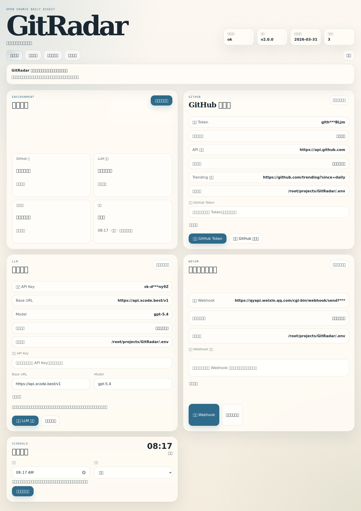
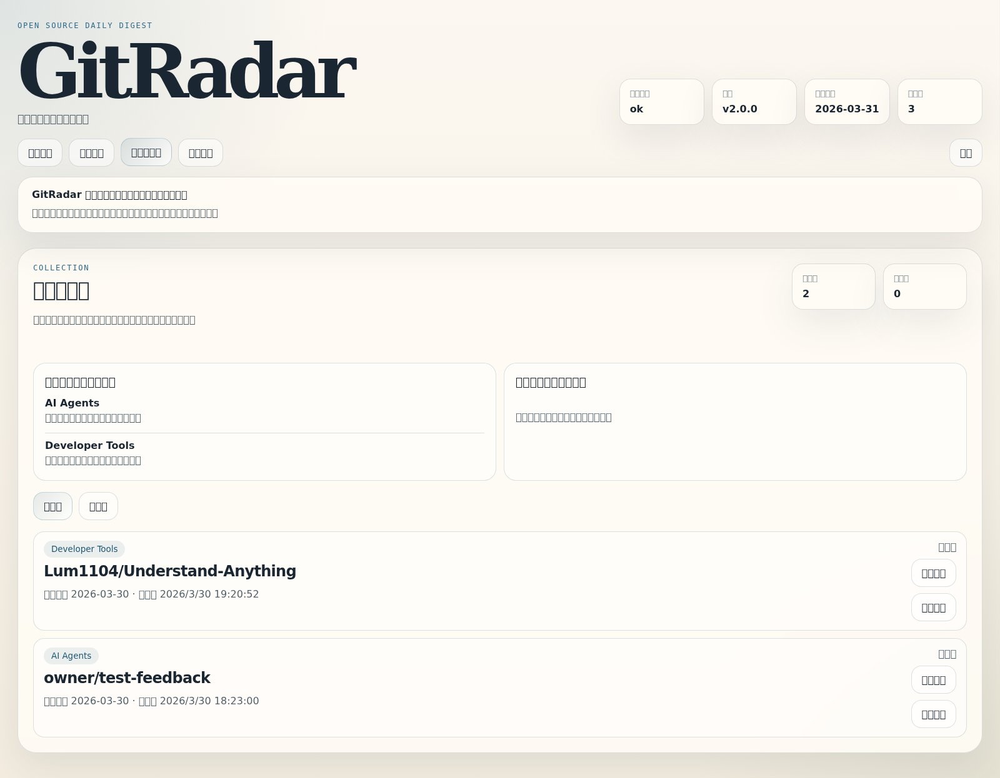
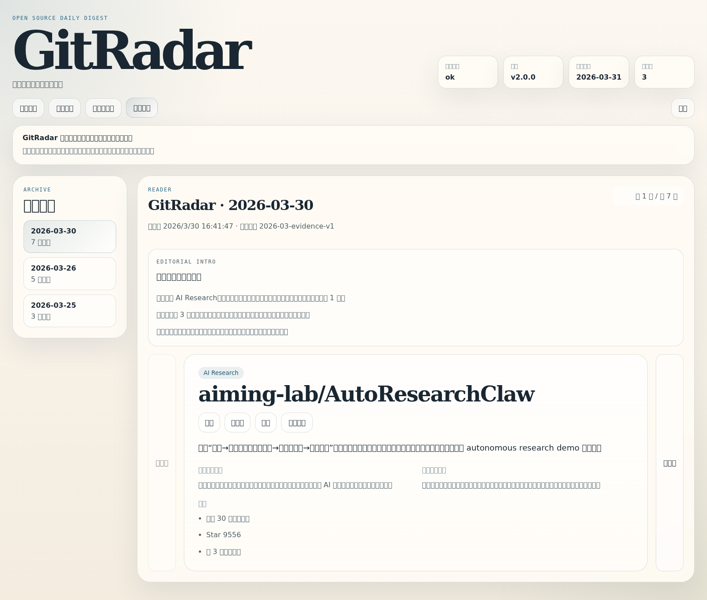

# GitRadar


> 一个把“今天值得看什么”收敛成中文日报，并持续沉淀个人兴趣轨迹的 GitHub 开源兴趣雷达。


GitRadar 面向个人与小团队，用 GitHub 候选信号、规则筛选、证据整理和 LLM 编辑，把每天真正值得看的开源项目收敛成一份可解释的中文日报。它不只生成日报，还把归档、反馈、偏好提示和环境验证统一收口到本地中文控制台里。

GitRadar 2.0 的重点已经从“把日报发出去”转向“把判断长期保留下来”：为什么选这些项目、为什么是今天、我最近真正关心什么、当前这套系统是不是活的，都能直接在产品里看到。

## 快速入口

- GitHub Pages 展示页：<https://noreply1018.github.io/GitRadar/>
- Release：<https://github.com/Noreply1018/GitRadar/releases>
- Showcase：[`docs/showcase.md`](./docs/showcase.md)
- 架构与路线：[`docs/architecture-roadmap.md`](./docs/architecture-roadmap.md)
- 开发约定：[`docs/development.md`](./docs/development.md)

## 一眼看懂

- 定位：中文开源项目雷达，不是热榜搬运器
- 产出：每天一份“为什么值得看、为什么是现在”的中文日报
- 形态：CLI + Docker + 本地中文控制台
- 差异：证据化发现、反馈闭环、偏好提示、环境可用性指纹、可回看归档

## 现在长什么样


| 首页与环境总览                                                   | 环境配置与可用性指纹                                                           |
| ---------------------------------------------------------------- | ------------------------------------------------------------------------------ |
|  |  |

| 收藏、待看与兴趣轨迹                                               | 归档日报阅读                                                                         |
| ------------------------------------------------------------------ | ------------------------------------------------------------------------------------ |
|  |  |

## 核心能力

- 证据化发现：不是直接抄 Trending，而是从 Trending、最近更新、最近创建三类候选里收敛当天真正值得看的项目
- 中文编辑日报：每条项目都带“做什么、为什么值得看、为什么是现在、证据、新意、热度”
- 本地中文控制台：把环境配置、主题偏好、反馈、归档阅读和验证入口放到一个界面
- 轻反馈闭环：支持对归档项目标记 `收藏 / 稍后看 / 跳过`
- 轻个性化：根据已有反馈生成兴趣轨迹和偏好学习提示，但不做失控的黑盒推荐
- 环境确定感：GitHub / LLM / 企业微信会显示最近一次成功验证的可用性指纹
- 长期可复盘：本地保留归档、反馈、失败报告和分析结果
- 多运行方式：CLI、Docker、本地控制台、Windows 双击启动都可用

## 它解决的问题

GitHub 上每天都有很多项目在涨星，但真正的问题不是“什么热”，而是：

- 今天到底哪些项目值得点进去看
- 为什么是这些项目
- 为什么是今天
- 我最近到底对哪些方向持续有兴趣
- 我的 GitRadar 配置现在到底是不是活的

GitRadar 把这些问题拆成一条稳定链路：

1. 抓 GitHub 候选
2. 用规则做筛选和主题控制
3. 用模型在受限候选池内完成中文编辑
4. 把结果保存成可重看的归档
5. 记录后续反馈，形成轻量个性化

## 快速开始

### 1. 准备环境

要求：

- Node.js 20+
- npm 10+
- 可用的 GitHub Token
- 可用的 LLM 网关配置
- 如果要发群消息，需要企业微信群机器人 Webhook

初始化：

```bash
cp .env.example .env
npm install
```

### 2. 启动本地控制台

```bash
npm run build:web
npm run start:console
```

默认监听：

- 控制台与本地 API：`http://127.0.0.1:3210`

开发模式：

```bash
npm run dev:web-api
npm run dev:web
```

开发时默认端口：

- API：`http://127.0.0.1:3210`
- 前端开发服务：`http://127.0.0.1:4173`

### 3. 更新展示截图或社交素材

控制台截图：

```bash
npm run capture:screenshots
```

SVG 主视觉转 PNG：

```bash
npm run render:assets
```

输出目录：

- 控制台截图：`docs/assets/console/`
- 社交素材 PNG：`docs/assets/`

## Docker 运行

如果你希望 GitRadar 长期驻留在本机，Docker 是最稳的运行方式。

启动：

```bash
docker compose up --build
```

停止：

```bash
docker compose down
```

默认行为：

- 控制台端口：`127.0.0.1:3210`
- 时区：`Asia/Shanghai`
- 容器内日报任务时间：`08:17`
- 定时执行命令：`npm run generate:digest:send`

宿主机保留数据：

- `config/`
- `data/`
- `.env`

## Windows 双击启动

如果你更希望以“本地应用”的方式使用 GitRadar，仓库自带了 Windows 启动脚本。

前提：

- 已安装并启动 Docker Desktop
- 已准备好 `.env`
- 仓库已 clone 到本机

首次准备：

```bash
cp .env.example .env
```

Windows 上可直接双击：

- `start-gitradar.bat`
- `stop-gitradar.bat`

## CLI 入口

```bash
npm run validate:digest-rules
npm run generate:digest
npm run generate:digest -- --send
npm run analyze:digest -- --date 2026-03-30
npm run feedback:list
npm run migrate:archives
npm run send:wecom:sample
```

常见用途：

- `validate:digest-rules`：校验 `config/digest-rules.json`
- `generate:digest`：抓取、筛选、编辑并写入日报归档
- `generate:digest -- --send`：生成日报后发送企业微信
- `analyze:digest`：分析某天归档结果
- `feedback:list`：查看收藏、稍后看和跳过反馈
- `migrate:archives`：把旧归档迁移到当前 schema
- `send:wecom:sample`：验证企业微信群机器人链路

## 配置结构

- 规则配置：`config/digest-rules.json`
- 调度配置：`config/schedule.json`
- 环境变量：`.env`
- 运行数据：`data/`

必填环境变量：

- `GITHUB_TOKEN`
- `GR_API_KEY`
- `GR_BASE_URL`
- `GR_MODEL`
- `GITRADAR_WECOM_WEBHOOK_URL`

## 项目治理

- 安全策略：[`SECURITY.md`](./SECURITY.md)
- 贡献约定：[`CONTRIBUTING.md`](./CONTRIBUTING.md)
- 行为准则：[`CODE_OF_CONDUCT.md`](./CODE_OF_CONDUCT.md)
- PR 模板：[`/.github/pull_request_template.md`](./.github/pull_request_template.md)

## 许可证

GitRadar 使用 [MIT License](./LICENSE)。
