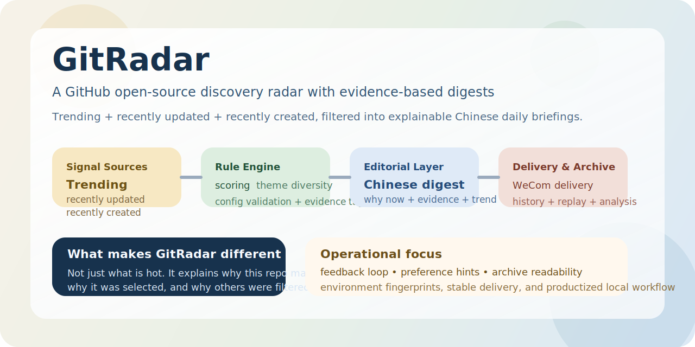

# GitRadar


> 一个把候选发现、中文日报、发送、归档和反馈全部收敛到 GitHub 仓库的开源日报系统。



GitRadar 3.0.0 只有一条正式链路：

- GitHub Actions 负责定时或手动运行
- 仓库配置文件负责非敏感正式配置
- GitHub Secrets 负责密钥与凭据
- `data/history`、`data/runtime`、`data/feedback` 负责正式数据沉淀
- 控制台负责读取远端正式状态并编辑仓库内可版本化配置

## 产品定义

GitRadar 不只是“抓热门仓库”，而是围绕每日发现建立一条完整产品链路：

- 候选发现：从 Trending、最近更新、最近创建等来源收集信号
- 规则收敛：按主题、成熟度、多样性和反馈历史筛掉噪声
- 中文成稿：回答“是什么、为什么值得看、为什么是今天”
- 远端发送：由 GitHub Actions 调用发送器完成投递
- 仓库归档：把日报、运行状态和反馈长期沉淀回仓库
- 控制台阅读：以前端查看归档、调度、偏好和最近运行状态

GitRadar 3.0.0 的核心原则：

- 单一正式执行器：GitHub Actions
- 单一正式归档源：GitHub 仓库
- 单一正式配置源：仓库配置文件 + GitHub Secrets
- 单一正式阅读入口：GitHub-first 控制台
- 所有正式状态都以仓库中的远端结果为准

## 使用方式

### 1. 创建自己的仓库

- 使用 `Use this template`
- 或 fork 当前仓库

### 2. 配置 GitHub Secrets

至少需要这些 Secrets：

- `GITRADAR_GITHUB_TOKEN`
- `GR_API_KEY`
- `GR_BASE_URL`
- `GR_MODEL`
- `GITRADAR_WECOM_WEBHOOK_URL`

### 3. 调整仓库配置

正式配置文件包括：

- `config/schedule.json`
- `config/digest-rules.json`
- `config/user-preferences.json`

### 4. 启用远端工作流

- 打开仓库 `Actions`
- 启用 `Daily Digest`
- 首次建议先手动 `Run workflow`

成功运行后，GitRadar 会把正式结果写回仓库：

- `data/history/*.json`
- `data/runtime/github-runtime.json`
- `data/feedback/feedback-events.jsonl`
- `data/feedback/feedback-state.json`

## 控制台定位

控制台是 GitRadar 的管理与阅读界面，不是第二套正式运行器。它负责：

- 展示最近一次远端运行状态
- 展示和阅读正式归档
- 编辑仓库中的调度与偏好配置
- 记录收藏、稍后看、跳过等反馈
- 展示 Secrets 的映射位置与最近验证结果

启动控制台：

```bash
npm install
npm run build:web
npm run start:console
```

默认地址：`http://127.0.0.1:3210`

开发模式：

```bash
npm run dev:web-api
npm run dev:web
```

## 开发命令

```bash
npm run validate:digest-rules
npm run generate:digest
npm run generate:digest -- --send
npm run analyze:digest -- --date 2026-03-30
npm run feedback:list
npm run send:wecom:sample
```

这些命令用于仓库开发、调试和验证；正式运行仍以 `Daily Digest` 工作流为准。

本地开发如需注入环境变量，请以 [`docs/examples/development.env.example`](./docs/examples/development.env.example) 为模板；它只服务于开发调试，不代表正式配置入口。

## 文档入口

- 架构设计：[`docs/architecture-roadmap.md`](./docs/architecture-roadmap.md)
- 开发与验证：[`docs/development.md`](./docs/development.md)
- 配置说明：[`config/README.md`](./config/README.md)
- 数据目录说明：[`data/README.md`](./data/README.md)
- 推送链路说明：[`docs/push-delivery.md`](./docs/push-delivery.md)

## 项目治理

- 安全策略：[`SECURITY.md`](./SECURITY.md)
- 贡献约定：[`CONTRIBUTING.md`](./CONTRIBUTING.md)
- 行为准则：[`CODE_OF_CONDUCT.md`](./CODE_OF_CONDUCT.md)
- PR 模板：[`/.github/pull_request_template.md`](./.github/pull_request_template.md)

## 许可证

GitRadar 使用 [MIT License](./LICENSE)。
