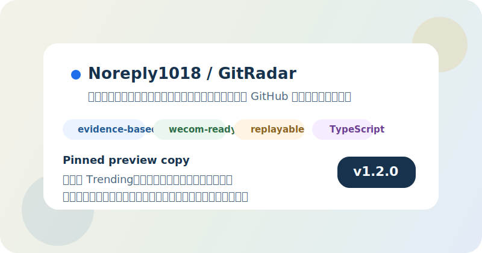

# GitHub Profile 置顶配置清单

这份清单用于把 GitRadar 配成一个适合放在 GitHub Profile pinned repositories 区域的项目卡片。

目标不是“仓库能被看到”，而是让别人一眼看懂：

- 这是个什么产品
- 它和普通热榜工具有什么区别
- 当前版本已经做到什么程度
- 点进去后应该先看哪里

## 推荐使用的说明文案

### 置顶仓库标题下的一句话说明

如果你要在 GitHub Profile 的 pinned 区域配合截图、介绍或外部说明一起使用，推荐优先使用这版：

```text
一个可解释的 GitHub 开源项目发现雷达，不只告诉你今天什么项目热，还会告诉你为什么今天值得看。
```

更偏工程能力的一版：

```text
一个带证据化中文日报、企业微信发送和可复盘归档的 GitHub 开源项目发现雷达。
```

更偏产品展示的一版：

```text
把 GitHub Trending、最近更新和最近创建信号整理成带证据的中文日报与长期归档。
```

## 推荐搭配的视觉素材

### 首选：Pinned 预览图

用于：

- GitHub Profile pinned 仓库截图
- 发群、发帖、发朋友圈时配合仓库卡片展示
- 作为“这是个正式产品仓库”的第一视觉

素材路径：

- [github-pinned-preview.svg](./assets/github-pinned-preview.svg)

预览：



### 补充：真实实发样例图

当你想强调“这不是概念产品，而是真正跑通并送达的链路”时，再补这张图：

- [wecom-sample-digest.svg](./assets/wecom-sample-digest.svg)

## 推荐的 GitHub Profile 展示顺序

如果你的 GitHub Profile 里会置顶多个项目，建议 GitRadar 放在偏前的位置，并按下面的逻辑来展示：

1. 把 GitRadar 放在前 1 到 3 个 pinned 仓库位里
2. 用 pinned preview 图作为对外传播时的首图
3. 仓库说明口径尽量统一，不要一会儿强调脚本，一会儿强调平台
4. 点进仓库后默认让 README 先承担产品页作用
5. 需要更完整介绍时，再引导到 `docs/showcase.md`

## 可直接照着做的配置清单

### 仓库本身

- [x] Release 已存在：`v1.2.0`
- [x] 仓库首页 README 已适合对外展示
- [x] 展示页已准备好：`docs/showcase.md`
- [x] 社交传播套件已准备好：`docs/social-preview-kit.md`
- [x] Pinned 预览图已准备好
- [x] Release 封面图已准备好
- [x] 企业微信实发样例图已准备好

### GitHub About

- [x] 中文版 About 描述已配置
- [x] Homepage 已指向展示页
- [x] Topics 已配置

当前远端 About 中文描述建议保持为：

```text
一个可解释的 GitHub 开源项目发现雷达，提供带证据的中文日报、企业微信发送和可复盘归档。
```

### GitHub Profile 置顶仓库说明文案

如果你在个人主页介绍、截图说明、固定帖文案里需要一句话介绍 GitRadar，优先用：

```text
一个可解释的 GitHub 开源项目发现雷达，不只告诉你今天什么项目热，还会告诉你为什么今天值得看。
```

### 对外展示入口

推荐你在对外分享时按下面顺序放链接：

1. 仓库首页  
   `https://github.com/Noreply1018/GitRadar`
2. 展示页  
   `https://github.com/Noreply1018/GitRadar/blob/main/docs/showcase.md`
3. Release  
   `https://github.com/Noreply1018/GitRadar/releases/tag/v1.2.0`

## 推荐的使用方式

### 只发一个链接时

直接发仓库首页：

```text
https://github.com/Noreply1018/GitRadar
```

配文推荐：

```text
这是一个可解释的 GitHub 开源项目发现雷达，会把今天值得看的项目整理成带证据的中文日报。
```

### 发 GitHub Profile 截图时

推荐组合：

1. Profile 上的 GitRadar pinned 仓库卡片
2. [github-pinned-preview.svg](./assets/github-pinned-preview.svg)
3. 一句产品说明文案

### 发版本更新时

推荐组合：

1. Release 封面图
2. Release 说明
3. 企业微信实发样例图

## 关联文档

- [社交传播套件](./social-preview-kit.md)
- [传播文案](./promo-copy.md)
- [项目展示页](./showcase.md)
- [README](../README.md)
