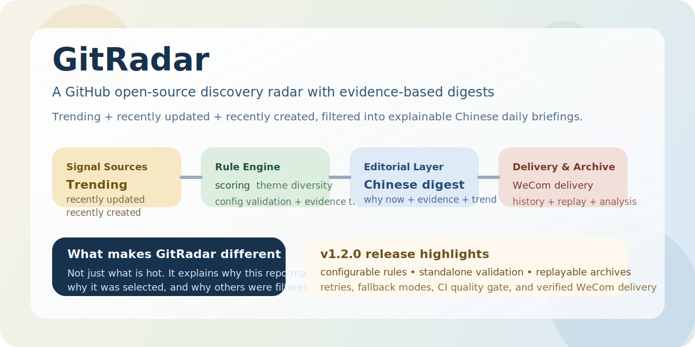
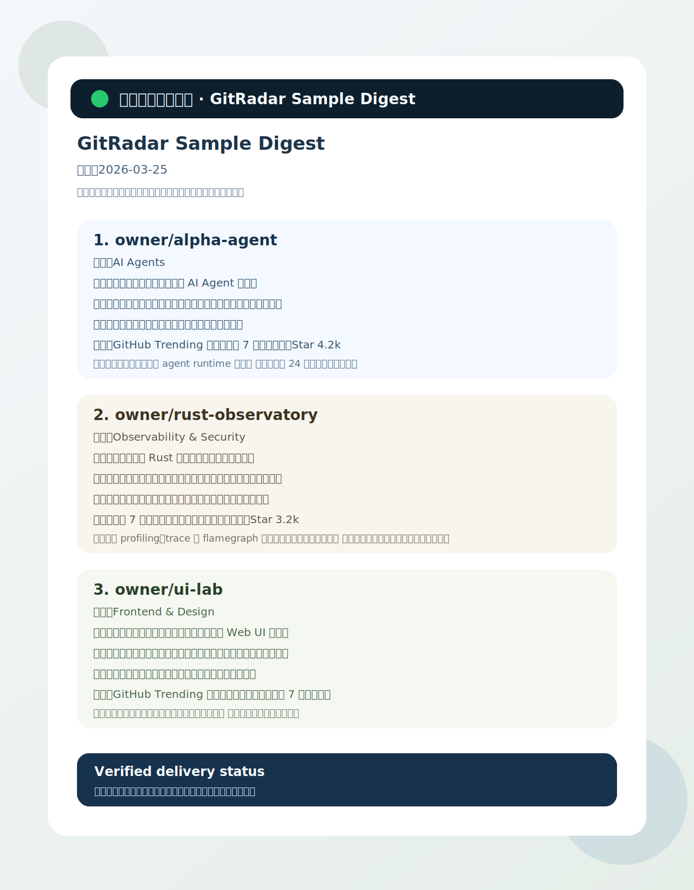

# GitRadar 展示页




## 一句话介绍

GitRadar 是一个面向个人和小团队的 GitHub 开源项目发现雷达。它每天从多类 GitHub 信号中筛出值得关注的仓库，生成带证据的中文日报，并支持企业微信分发、历史归档、复盘分析和规则配置化管理。

## 它适合谁

- 想持续发现高质量 GitHub 开源项目的个人开发者
- 需要给团队同步“今天值得看的开源方向”的技术负责人
- 想把开源发现做成稳定日报流程的内容或研发团队
- 希望沉淀“为什么选它、为什么没选别的”的长期观察档案的人

## 它解决的不是“热榜”，而是“解释”

很多 GitHub 项目发现工具只能回答一个问题：最近什么热。

GitRadar 试图回答四个问题：

- 今天有哪些项目值得看
- 为什么是这些项目
- 为什么是今天
- 为什么另一些项目没有入选

它不是把 star 数抄一遍，而是把候选发现、规则筛选、证据整理、中文成稿和历史归档串成一条稳定链路。

## v1.2.0 亮点

这个版本把 GitRadar 推进到了可以稳定对外展示和正式发布的阶段。

### 1. 规则配置化

- 主题、黑名单、阈值、权重全部集中到 `config/digest-rules.json`
- 规则不再埋在业务代码内部，后续调规则更直接

### 2. 规则校验命令

- 新增 `npm run validate:digest-rules`
- 可以单独校验规则文件是否有效
- 坏配置会在启动前被显式拦住，而不是等主流程半途失败

### 3. 可复盘归档

- 保存候选列表、shortlist、LLM 候选池、入选理由和排除理由
- 支持按日期分析历史归档
- 支持旧归档迁移和已有 digest 重发

### 4. 更稳的主流程

- GitHub Trending 抓取支持重试
- 模型生成支持重试和模板降级
- 失败上下文会写入运行期失败报告

### 5. 实际链路验证

这个版本不只是“测试通过”：

- 已通过本地格式、类型、Markdown、YAML、单测校验
- 已通过 GitHub Actions CI
- 已真实终端执行企业微信群机器人发送
- 已有人眼确认企业微信群实际收到消息

## 企业微信实发样例

下面这张图基于已实际送达并由人工确认收到的企业微信样例消息整理而成：



## 一个典型输出长什么样

GitRadar 的日报不是只列 repo 名，而是包含：

- 仓库名
- 主题
- 做什么
- 为什么值得看
- 为什么是现在
- 证据
- 新意
- 热度

也就是说，日报天然就更适合团队内部同步、技术观察和后续复盘。

## 工作方式

当前 GitRadar 的固定流程是：

1. 抓取 GitHub Trending
2. 抓取最近更新和最近创建候选
3. 读取 README 摘要
4. 按规则配置过滤和打分
5. 推断主题并做多样性控制
6. 用模型基于候选池生成中文日报
7. 写入历史归档
8. 按需发送到企业微信

这里最关键的一点是：模型不是自由搜索 agent，只负责受限候选池内的最终中文编辑。

## 为什么这个产品值得继续做

GitHub 上每天会出现太多项目，但“发现”和“理解”不是同一件事。

GitRadar 的价值在于把发现过程结构化：

- 把热度信号变成证据
- 把推荐理由变成可复盘文本
- 把一次推送变成长期档案
- 把规则调整变成可校验配置

这意味着它未来不只是一条日报，还可以继续演进成：

- compare：比较两天或两轮候选差异
- collections：沉淀固定主题集合
- tracks：追踪连续升温的方向
- weekly review：把日数据提炼成周观察

## 如何快速演示

如果你要给别人现场演示 GitRadar，推荐顺序如下：

```bash
npm run validate:digest-rules
npm run generate:digest
npm run analyze:digest -- --date YYYY-MM-DD
npm run send:wecom:sample
```

演示重点建议依次展示：

1. 规则配置是仓库文件，不是写死在代码里
2. 规则可以单独校验
3. 生成结果会写入归档
4. 归档可以分析和重发
5. 企业微信链路是真实可发的

## 仓库入口

- [README](../README.md)
- [社交传播套件](./social-preview-kit.md)
- [传播文案](./promo-copy.md)
- [企业微信样例展示图](./assets/wecom-sample-digest.svg)
- [架构设计与版本路线](./architecture-roadmap.md)
- [开发规范](./development.md)
- [推送与交付设计](./push-delivery.md)
- [版本管理说明](./versioning.md)
- [Changelog](../CHANGELOG.md)
