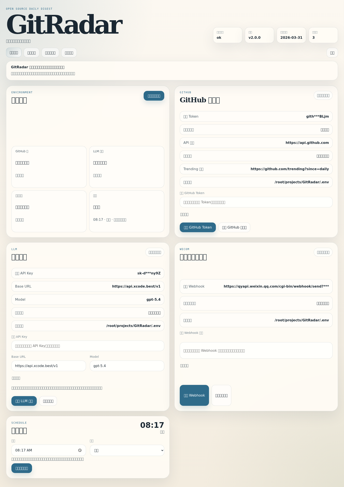
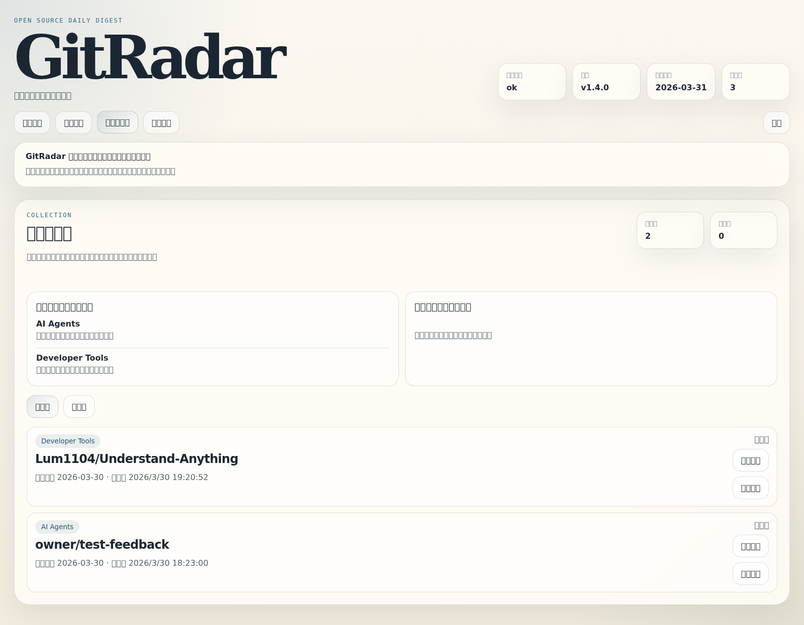
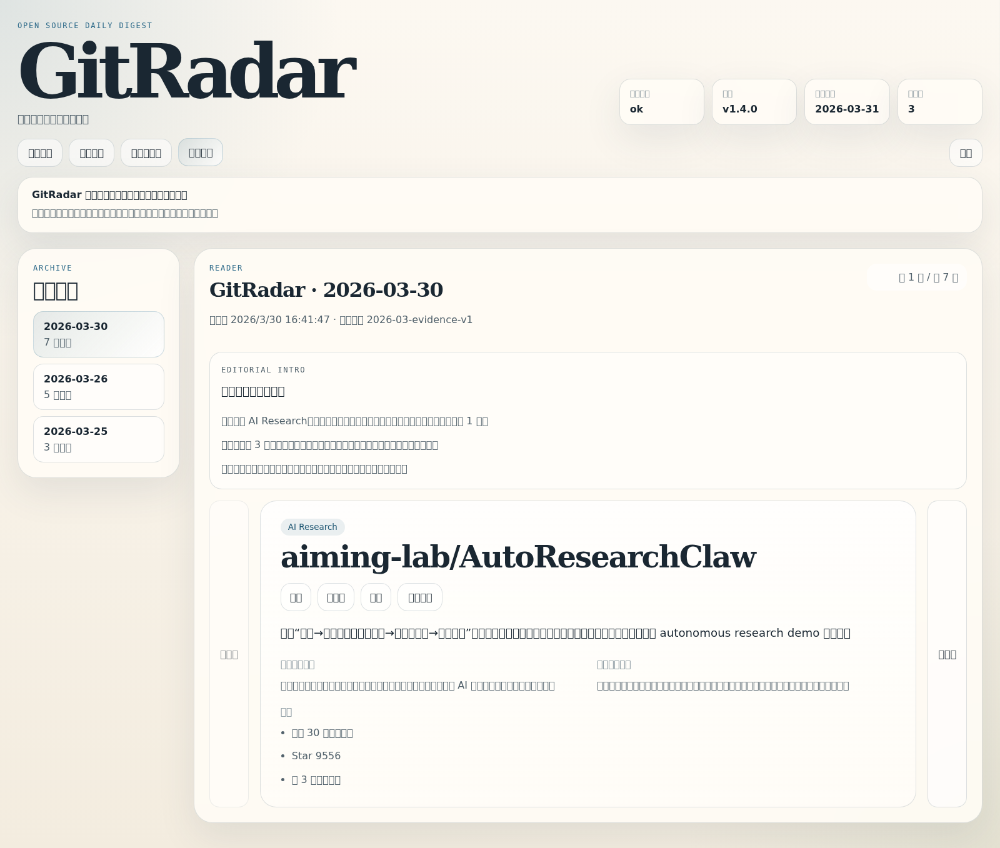

# GitRadar 展示页

## 一句话介绍

GitRadar 是一个面向个人和小团队的 GitHub 开源兴趣雷达。它每天从 GitHub 候选信号中筛出值得关注的项目，生成带证据的中文日报，并通过本地控制台把归档、反馈、偏好提示和环境验证收口成一套长期可用的产品。

## 它现在已经不只是日报脚本

GitRadar 2.0 解决的不是“怎么把热门仓库列出来”，而是：

- 今天到底哪些项目值得看
- 为什么是这些项目
- 为什么是今天
- 我最近到底对哪些主题持续有兴趣
- 当前这套系统是不是活的

所以它同时具备：

- 发现能力
- 编辑能力
- 归档能力
- 反馈能力
- 轻个性化能力
- 本地控制台能力

## 真实控制台截图

### 首页

### 环境配置

### 收藏与兴趣轨迹

### 归档日报阅读

## v2.0.0 亮点

### 1. 轻反馈闭环

- 归档页可直接标记 `收藏 / 稍后看 / 跳过`
- 反馈不再只是记录，而是会反哺下一轮轻量排序
- GitRadar 开始具备“这更像我的雷达”的方向感

### 2. 个人兴趣轨迹

- 收藏页顶部直接展示最近真正感兴趣的主题
- 也会展示最近连续跳过的主题
- 用户不需要进分析面板，就能看到最近偏好变化

### 3. 编辑型归档

- 归档顶部新增总编前言，解释“今天为什么是这几条”
- 不是加一个大分析页面，而是在阅读前先给出 3 句编辑判断

### 4. 半自动偏好学习

- 系统不会黑盒改规则
- 会在合适的时候提示：你最近连续收藏了某类主题，是否把它加入关心主题
- 既克制，又能让反馈有后劲

### 5. 环境可用性指纹

- GitHub 显示最近成功验证账号
- LLM 显示最近成功模型与 endpoint
- 企业微信显示最近一次测试发送时间
- 用户可以一眼看出系统是不是活的，而不是只看到“已配置”

## 企业微信实发样例

下面这张图基于已实际送达并由人工确认收到的企业微信样例消息整理而成：

## 为什么这个版本值得发布

GitRadar 2.0 的意义不在于“又多了一个功能”，而在于产品边界变了：

- 它不再只是日报生成器
- 它开始具备个人兴趣沉淀能力
- 它有了更像编辑产品的阅读体验
- 它把运行确定感做成了控制台体验的一部分

换句话说，GitRadar 现在已经是一个可持续使用的开源兴趣雷达产品，而不是一条会发消息的脚本链路。

## 仓库入口

- [README](../README.md)
- [社交传播套件](./social-preview-kit.md)
- [传播文案](./promo-copy.md)
- [版本管理说明](./versioning.md)
- [架构设计与版本路线](./architecture-roadmap.md)
- [Changelog](../CHANGELOG.md)
