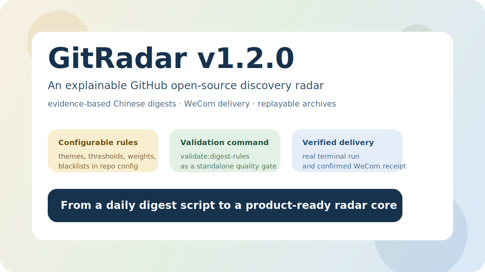

# GitRadar 社交传播套件

这页用于统一 GitRadar 在 GitHub Profile、Release 页面和社交平台上的视觉与文案素材。

## 资产清单

- GitHub 仓库置顶预览图：
  [github-pinned-preview.svg](./assets/github-pinned-preview.svg)
- Release 封面图：
  [release-cover-v1.2.0.svg](./assets/release-cover-v1.2.0.svg)
- 企业微信实发样例图：
  [wecom-sample-digest.svg](./assets/wecom-sample-digest.svg)
- 传播文案：
  [promo-copy.md](./promo-copy.md)
- GitHub Profile 置顶配置清单：
  [profile-pinned-checklist.md](./profile-pinned-checklist.md)

## About 短描述中文版

适合中文语境下介绍 GitRadar 的一句话短描述：

```text
一个带证据化中文日报、企业微信发送和可复盘归档的 GitHub 开源项目发现雷达。
```

更偏产品口径的一版：

```text
一个可解释的 GitHub 开源项目发现雷达，不只告诉你今天什么项目热，还会告诉你为什么今天值得看。
```

## GitHub 仓库置顶图建议

适用场景：

- GitHub Profile pinned repo 截图
- 发群或发帖时作为仓库卡片配图
- 用作 README / showcase 的附加视觉素材

建议使用：

- [github-pinned-preview.svg](./assets/github-pinned-preview.svg)

预览：


## Release 封面图建议

适用场景：

- GitHub Release 说明页首图
- 社交平台发版海报
- 发群同步版本更新时的封面图

建议使用：

- [release-cover-v1.2.0.svg](./assets/release-cover-v1.2.0.svg)

预览：



## 组合使用建议

如果你要在 GitHub 和社交平台同步发布 GitRadar，推荐顺序：

1. GitHub About 使用中文版短描述
2. Profile pinned repo 或仓库推广使用置顶预览图
3. Release 页面或发版动态使用 release 封面图
4. 想强调“这不是概念图”时，再补企业微信实发样例图

## 关联文档

- [README](../README.md)
- [展示页](./showcase.md)
- [传播文案](./promo-copy.md)
- [GitHub Profile 置顶配置清单](./profile-pinned-checklist.md)
